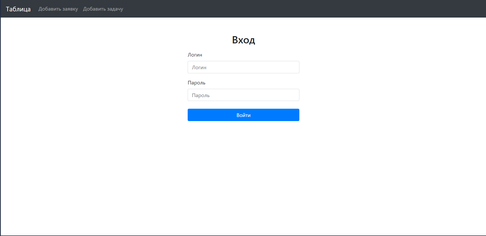
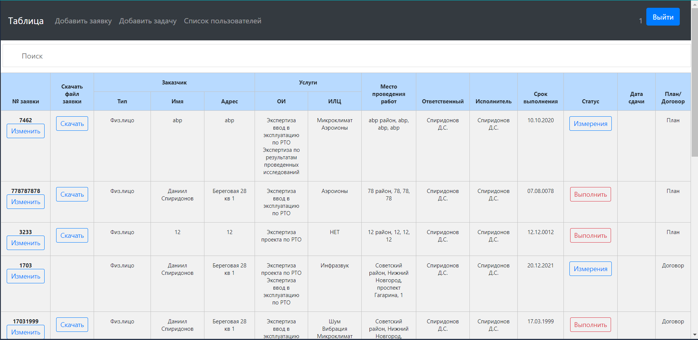

# Проект в стадии разработки!!!

### О программе
Это Web-приложение для автоматизации системы управления данными мед.учреждения.

Данный проект написан на языке Java и собран через Maven.
В нем используются такие инструменты как:

•	Spring Boot

• Spring MVC

•	Spring Security

•	PostgreSQL

• Bootstrap

•	FreeMarker

Также участие принимали следующие языки

•	HTML

•	чуть-чуть CSS

•	и еще меньше JavaScript

***
### Скриншоты
#### Вход

#### Таблица заявок

#### Добавление заявки

#### Список пользователей (только для админа)

#### Регистрация нового пользователя (только для админа)

#### Выполнение задачи (ввод измерений)

### И т.д.
